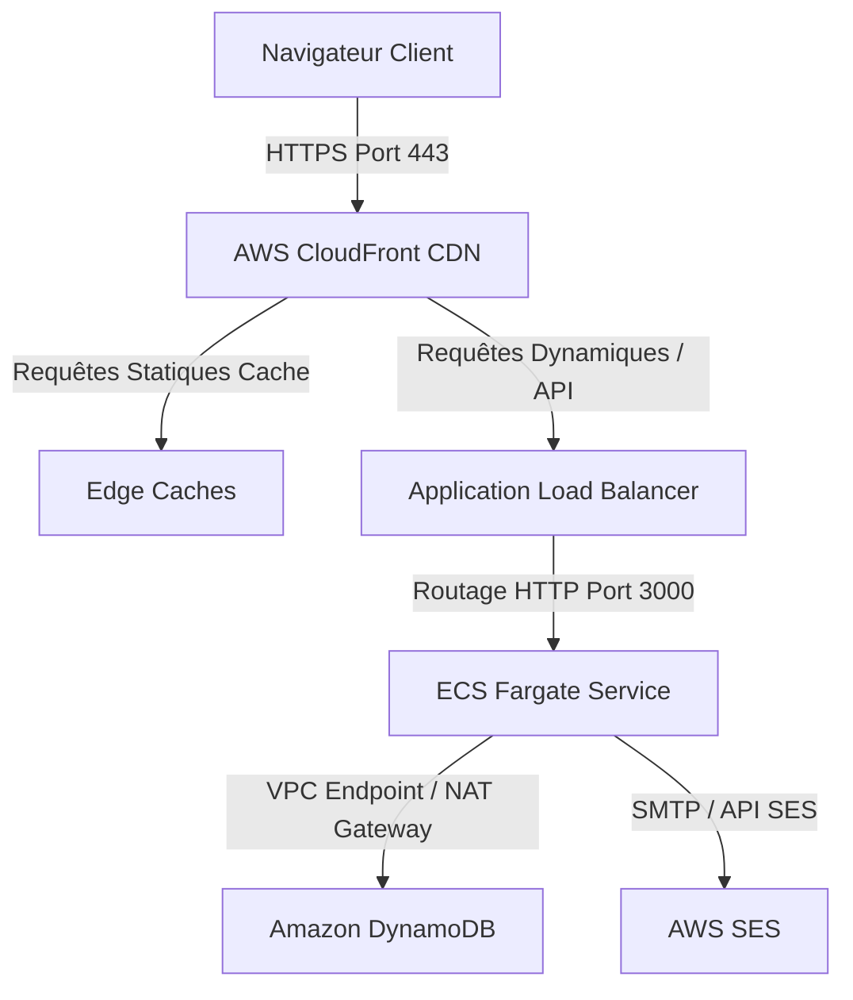

# Architecture de l'Infrastructure AWS et Provisionnement IaC - QuickPoll 🏗️

Ce document présente une vue d'ensemble technique complète et approfondie de l'infrastructure AWS de **QuickPoll**, gérée en tant que code (IaC) via **Terraform**. L'architecture a été conçue pour être hautement disponible, résiliente, sécurisée (modèle Zero-Trust) et performante, conformément aux meilleures pratiques de l'AWS Well-Architected Framework.

---

## 📋 Table des Matières
1. [Schéma d'Architecture](#1-schéma-darchitecture)
2. [Analyse Détaillée du Réseau (Networking VPC)](#2-analyse-détaillée-du-réseau-networking-vpc)
3. [Modules Terraform Applicatifs](#3-modules-terraform-applicatifs)
   - [A. Dépôt de Conteneurs (Amazon ECR)](#a-dépôt-de-conteneurs-amazon-ecr)
   - [B. Base de Données NoSQL (Amazon DynamoDB)](#b-base-de-données-nosql-amazon-dynamodb)
   - [C. Orchestration Sans Serveur (Amazon ECS Fargate)](#c-orchestration-sans-serveur-amazon-ecs-fargate)
   - [D. Répartition de Charge (Application Load Balancer)](#d-répartition-de-charge-application-load-balancer)
   - [E. Diffusion Globale et Caching (AWS CloudFront CDN)](#e-diffusion-globale-et-caching-aws-cloudfront-cdn)
   - [F. Service de Messagerie (Amazon SES)](#f-service-de-messagerie-amazon-ses)
4. [Sécurité IAM et Politique de Moindre Privilège](#4-sécurité-iam-et-politique-de-moindre-privilège)
5. [Guide des Commandes Terraform](#5-guide-des-commandes-terraform)
6. [Pipeline CI/CD Automatisé (GitHub Actions)](#6-pipeline-cicd-automatisé-github-actions)

---

## 1. Schéma d'Architecture

Le trafic externe est filtré à la périphérie (Edge Locations), mis en cache si possible, puis acheminé vers un répartiteur de charge public avant d'être distribué de manière privée aux conteneurs de l'application Next.js.



### Parcours d'une requête HTTP/HTTPS :
1. **Périphérie CloudFront** : Le navigateur du client résout l'adresse DNS via Amazon Route 53 (ou un fournisseur alternatif) vers la distribution globale **AWS CloudFront**. CloudFront gère la terminaison SSL (HTTPS).
2. **Gestion du cache** :
   * Si la requête pointe vers les ressources statiques générées par Next.js (ex: `/_next/static/*`), CloudFront la sert instantanément depuis la mémoire cache locale (Edge Location), réduisant la latence à quelques millisecondes.
   * Si la requête concerne du contenu dynamique (création de sondage, soumission de vote, flux SSE `/api/polls/[id]/stream`), la requête contourne le cache et est transmise à l'**Application Load Balancer (ALB)**.
3. **Répartition du trafic** : L'ALB reçoit la requête et la répartit sur les conteneurs Next.js sains hébergés sur **Amazon ECS Fargate** au sein des sous-réseaux privés du VPC.
4. **Persistance et Alertes** : L'application interagit avec les tables **Amazon DynamoDB** et envoie des alertes de vote en appelant l'API d'**Amazon SES**.

---

## 2. Analyse Détaillée du Réseau (Networking VPC)

Le réseau constitue le socle de sécurité de l'application. Le module `networking` provisionne un **VPC (Virtual Private Cloud)** isolé avec les caractéristiques suivantes :

* **VPC CIDR Block** : Défini à `10.0.0.0/16` (permettant jusqu'à 65 536 adresses IP privées).
* **Zones de Disponibilité (AZ - Availability Zones)** : Réparti sur deux zones physiques distinctes (par exemple, `eu-west-1a` et `eu-west-1b`) afin d'éviter tout point de défaillance unique (Single Point of Failure).
* **Sous-réseaux Publics (Public Subnets)** :
  * Deux sous-réseaux `/24` (ex: `10.0.1.0/24` et `10.0.2.0/24`).
  * Associés à une **Internet Gateway (IGW)** pour permettre le trafic entrant et sortant.
  * Hébergent uniquement l'**Application Load Balancer (ALB)** public et la **NAT Gateway**.
* **Sous-réseaux Privés (Private Subnets)** :
  * Deux sous-réseaux `/24` (ex: `10.0.3.0/24` et `10.0.4.0/24`).
  * N'ont aucune route vers l'Internet Gateway publique.
  * Hébergent les conteneurs applicatifs **AWS ECS Fargate**.
* **NAT Gateway & Table de Routage** :
  * Une NAT Gateway (Network Address Translation) est déployée dans un sous-réseau public.
  * Les sous-réseaux privés sont configurés avec une table de routage redirigeant le trafic sortant (`0.0.0.0/0`) vers cette NAT Gateway.
  * **Intérêt** : Permet aux conteneurs privés d'initier des connexions sortantes (téléchargement de patchs, appels d'API externes, SDK AWS) tout en interdisant à toute entité extérieure d'initier une connexion directe vers les conteneurs.

---

## 3. Modules Terraform Applicatifs

Chaque composant technique de QuickPoll est encapsulé dans un module Terraform réutilisable situé sous `infrastructure/modules/` :

### A. Dépôt de Conteneurs (Amazon ECR)
Le module `ecr` provisionne un registre privé sécurisé pour stocker les images Docker.
* **Chiffrement** : Les images sont chiffrées au repos par défaut (`AES256`).
* **Politique de cycle de vie (Lifecycle Policy)** : Pour optimiser les coûts de stockage, Terraform configure une règle qui supprime automatiquement les anciennes images et ne conserve que les **10 builds les plus récents**. Les images non marquées sont purgées après 24 heures.

### B. Base de Données NoSQL (Amazon DynamoDB)
Le module `dynamodb` crée les deux tables requises par l'application :
1. **Table `quickpoll-polls`** :
   * Clé de partition (`HASH`) : `id` (String).
   * Contient les métadonnées et la configuration du sondage.
2. **Table `quickpoll-votes`** :
   * Clé de partition (`HASH`) : `pollId` (String).
   * Clé de tri (`RANGE`) : `voterId` (String).
   * **Intérêt de la clé composée** : Cette configuration garantit l'unicité de la paire `(pollId, voterId)`. Si un utilisateur tente de voter deux fois pour le même sondage, DynamoDB rejette l'écriture, empêchant de manière robuste le double vote au niveau de la base de données.
* **Options de Résilience** :
  * **Point-in-Time Recovery (PITR)** : Activé. Permet de restaurer les tables à n'importe quelle seconde près au cours des 35 derniers jours en cas de corruption de données ou de mauvaise manipulation logicielle.
  * **Time To Live (TTL)** : Configuré sur l'attribut `expiresAt` pour supprimer automatiquement les données obsolètes après dépassement de la date de fin (optimisation des coûts de stockage).

### C. Orchestration Sans Serveur (Amazon ECS Fargate)
Le module `ecs` gère l'exécution des conteneurs sans provisionner ni administrer de serveurs EC2.
* **Fargate (Serverless)** : AWS se charge d'allouer la puissance CPU (0.5 vCPU) et mémoire (1 Go) définie pour chaque tâche.
* **Réseau Privé & Sécurité** : Les tâches ECS sont provisionnées dans les sous-réseaux privés. Leur groupe de sécurité (`ecs-sg`) bloque tout trafic entrant, **sauf** les requêtes provenant directement du groupe de sécurité de l'ALB (`alb-sg`) sur le port `3000`.
* **Haute Disponibilité** : Le service ECS maintient en permanence un compte ciblé (Desired Count) de **2 tâches saines**, réparties de manière équilibrée sur les deux zones de disponibilité physiques.
* **Déploiement Progressif (Rolling Updates)** :
  * `minimum_healthy_percent = 50` : Durant une mise à jour applicative, au moins 1 conteneur reste actif pour servir les clients.
  * `maximum_percent = 200` : ECS peut instancier jusqu'à 4 conteneurs simultanément pendant la phase de transition avant de détruire les anciens conteneurs.

### D. Répartition de Charge (Application Load Balancer)
Le module `alb` fait office de passerelle d'entrée.
* **Target Group & Health Check** : Il effectue périodiquement (toutes les 30 secondes) un appel HTTP GET sur la racine `/` des conteneurs. Si un conteneur ne répond pas avec un code HTTP 200 (par exemple en cas de crash de la boucle d'événements Node.js), l'ALB le déclare insain (unhealthy) et cesse immédiatement de lui envoyer du trafic. Un nouveau conteneur sain est instancié en parallèle par ECS pour le remplacer.

### E. Diffusion Globale et Caching (AWS CloudFront CDN)
Le module `cloudfront` optimise la vitesse d'affichage de QuickPoll dans le monde entier.
* **Caching intelligent** :
  * Les fichiers de compilation statique Next.js (`/_next/static/*` et `/public/*`) ont une politique de cache de longue durée (TTL d'un an). Les requêtes n'atteignent jamais nos conteneurs ECS, ce qui réduit considérablement les coûts de calcul.
  * Les requêtes dynamiques (`/api/*`, `/poll/[id]`, etc.) sont acheminées instantanément vers l'ALB sans mise en cache.
* **Sécurité SSL/TLS** : CloudFront force l'utilisation du protocole HTTPS (redirection automatique des requêtes HTTP port 80).

### F. Service de Messagerie (Amazon SES)
Le module `ses` configure AWS Simple Email Service pour l'envoi fiable de notifications e-mail lors du premier vote sur un sondage.
* Le rôle IAM de tâche ECS dispose de l'autorisation d'appeler l'API de messagerie SES pour envoyer des emails.

---

## 4. Sécurité IAM et Politique de Moindre Privilège

Pour se conformer au principe du moindre privilège, les conteneurs de QuickPoll utilisent deux rôles IAM bien distincts :

1. **Rôle d'Exécution ECS (ECS Task Execution Role)** :
   * Utilisé par l'agent AWS ECS sous-jacent (en dehors du conteneur).
   * **Autorisations** : Téléchargement de l'image Docker depuis Amazon ECR, écriture des logs applicatifs vers AWS CloudWatch.
2. **Rôle de Tâche ECS (ECS Task Role)** :
   * Utilisé directement par le code de l'application Next.js (au sein du conteneur).
   * **Autorisations limitées aux ressources applicatives** :
     * Lecture/écriture uniquement sur les deux tables DynamoDB `quickpoll-polls` et `quickpoll-votes`.
     * Envoi d'emails via AWS SES (action `ses:SendEmail` et `ses:SendRawEmail`).
     * Aucune autre ressource AWS (comme des seaux S3 ou d'autres bases de données) n'est accessible par ce rôle.

---

## 5. Guide des Commandes Terraform

L'infrastructure peut être déployée ou modifiée manuellement à l'aide des commandes standard de l'outil Terraform.

### 1. Initialiser le projet
Télécharge les plugins des fournisseurs (AWS) et configure le backend de stockage d'état Terraform.
```bash
cd infrastructure
terraform init
```

### 2. Planifier le déploiement
Génère et affiche le plan d'exécution des modifications sans les appliquer. Vous devez renseigner la variable `creator_jwt_secret` (clé secrète pour chiffrer les jetons d'administration des sondages).
```bash
terraform plan \
  -var="creator_jwt_secret=VOTRE_CLE_SECRETE_MIN_32_CHARS" \
  -var="ses_from_email=noreply@votre-domaine.com"
```

### 3. Appliquer les modifications
Provisionne les ressources réelles sur AWS.
```bash
terraform apply \
  -var="creator_jwt_secret=VOTRE_CLE_SECRETE_MIN_32_CHARS" \
  -var="ses_from_email=noreply@votre-domaine.com"
```

### 4. Détruire l'infrastructure
Supprime l'intégralité des ressources provisionnées sur AWS (Utile en fin de cycle de vie ou pour le nettoyage de tests).
```bash
terraform destroy
```

---

## 6. Pipeline CI/CD Automatisé (GitHub Actions)

QuickPoll implémente une automatisation complète des phases de test et de déploiement à l'aide de deux workflows GitHub Actions distincts.

### Intégration Continue (CI - `.github/workflows/ci.yml`)
Déclenché à chaque ouverture de Pull Request vers les branches `main` et `develop`.
* **Étape 1 : Lint & Test** : Exécute Vitest et ESLint pour valider la qualité logique et syntaxique du code TypeScript/Next.js.
* **Étape 2 : Build de validation** : Compile l'application Next.js pour s'assurer que le compilateur ne lève aucune erreur de type.
* **Étape 3 : Scan de vulnérabilités Docker (Trivy)** : Compile l'image Docker localement dans l'agent GitHub et l'analyse avec **Trivy** pour s'assurer de l'absence de packages système ou de modules NPM vulnérables (critiques ou à haute sévérité).

### Déploiement Continu (CD - `.github/workflows/deploy.yml`)
Déclenché automatiquement lors d'un push ou d'une fusion (merge) sur la branche `main`.
* **Étape 1 : Authentification OIDC** : GitHub s'authentifie temporairement auprès du compte AWS en utilisant OpenID Connect (OIDC) pour éviter d'avoir à stocker des clés d'accès AWS permanentes et risquées dans les secrets GitHub.
* **Étape 2 : ECR Login & Build** : Se connecte au registre ECR privé d'AWS, compile l'image de production Docker et la pousse avec deux tags : le SHA du commit GitHub actuel et le tag `latest`.
* **Étape 3 : Déploiement ECS progressif** : Appelle la commande AWS CLI pour forcer un nouveau déploiement sur le service ECS Fargate. Fargate télécharge la nouvelle image Docker, instancie les nouveaux conteneurs, s'assure qu'ils passent le Health Check de l'ALB, puis éteint progressivement les anciens conteneurs sans aucune interruption de service.
* **Étape 4 : Attente de stabilité** : Le workflow attend la confirmation que le service ECS est stabilisé et s'assure que la mise à jour s'est déroulée avec succès.
