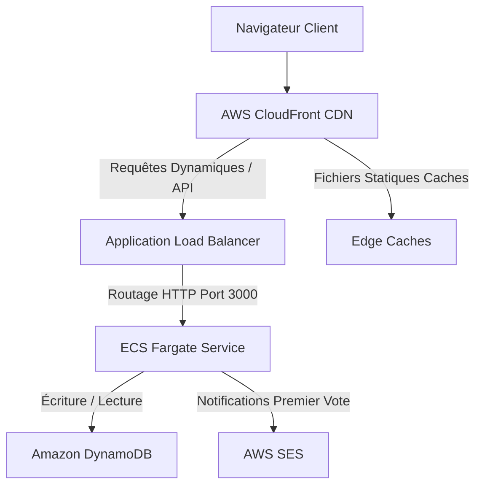

# Architecture de l'Infrastructure AWS - QuickPoll

Ce document décrit en détail l'infrastructure AWS de QuickPoll configurée à l'aide de Terraform. L'architecture a été conçue pour être hautement disponible, sécurisée, performante et conforme aux meilleures pratiques AWS.

---

## 1. Vue d'ensemble de l'Architecture

L'architecture repose sur un modèle classique à plusieurs niveaux (Multi-tier) conteneurisé, protégé par un réseau de diffusion de contenu (CDN) et un répartiteur de charge (ALB).



### Flux d'une requête :
1. Le **Client** accède au site via l'URL CloudFront (ou domaine personnalisé).
2. **AWS CloudFront (CDN)** intercepte la requête. Si la requête concerne des ressources statiques (ex: `/_next/static/*`), CloudFront la sert directement depuis son cache global (Edge Location).
3. Si la requête est dynamique (pages Next.js SSR ou routes d'API `/api/*`), CloudFront la transmet à l'**Application Load Balancer (ALB)** public.
4. L'**ALB** distribue le trafic aux conteneurs de l'application s'exécutant sur **AWS ECS Fargate** dans des sous-réseaux privés.
5. L'application interagit avec **Amazon DynamoDB** pour stocker/récupérer les sondages et les votes, et utilise **AWS SES** pour envoyer des alertes email lors des votes.

---

## 2. Description Détaillée des Modules Terraform

L'infrastructure est modulaire et divisée en 7 composants réutilisables sous `infrastructure/modules/` :

### A. Réseau et Connectivité (`networking`)
Ce module configure l'environnement VPC (Virtual Private Cloud) isolé.
* **VPC** : Segment réseau `/16` (ex: `10.0.0.0/16`) réparti sur 2 zones de disponibilité (AZ) pour la haute disponibilité.
* **Sous-réseaux Publics** : Deux sous-réseaux associés à une passerelle Internet (Internet Gateway). Ils hébergent l'ALB public.
* **Sous-réseaux Privés** : Deux sous-réseaux sécurisés sans route directe vers Internet. Ils hébergent les tâches ECS Fargate.
* **NAT Gateway / Internet Egress** : Une NAT Gateway est déployée dans le sous-réseau public pour permettre aux conteneurs ECS privés de télécharger des dépendances (ex: SDK AWS, bibliothèques Node) ou d'appeler des API tierces en toute sécurité.

### B. Registre de Conteneurs (`ecr`)
Héberge les images Docker de l'application Next.js.
* **Dépôt ECR** : Chiffrement des images au repos activé.
* **Règle de Cycle de Vie (Lifecycle Policy)** : Pour éviter les coûts de stockage inutiles, seules les 10 dernières images de conteneur sont conservées. Les images orphelines et non marquées (untagged) sont nettoyées automatiquement après 24 heures.

### C. Base de Données NoSQL (`dynamodb`)
Stocke l'état persistant de QuickPoll avec des performances à faible latence (quelques millisecondes).
* **Table `quickpoll-polls`** : Stocke les métadonnées des sondages. Clé de partition (`HASH`) : `id` (String).
* **Table `quickpoll-votes`** : Stocke les bulletins de vote. Clé de partition (`HASH`) : `pollId` (String), Clé de tri (`RANGE`) : `voterId` (String). Cette structure garantit qu'un votant ne peut voter qu'une seule fois par sondage grâce à la contrainte d'unicité de la clé primaire composée.
* **Fonctionnalités activées** :
  * **TTL (Time To Live)** : Supprime automatiquement les données expirées (si configuré) pour optimiser le stockage.
  * **Point-in-Time Recovery (PITR)** : Permet de restaurer les tables à n'importe quelle seconde des 35 derniers jours (protection contre les suppressions accidentelles).
  * **Chiffrement par défaut (SSE)** : Données chiffrées au repos à l'aide de clés gérées par AWS (KMS).

### D. Service de Conteneurs (`ecs`)
Gère l'exécution des conteneurs sans serveur grâce à AWS Fargate.
* **Cluster ECS** : Regroupement logique des services avec Container Insights activé pour le monitoring CloudWatch.
* **Définition de Tâche (Task Definition)** :
  * Spécifie la configuration CPU (512 Mo / 0.5 vCPU) et Mémoire (1024 Mo) par tâche.
  * Injecte les variables d'environnement nécessaires : `NODE_ENV`, `AWS_REGION`, `DYNAMODB_POLLS_TABLE`, `DYNAMODB_VOTES_TABLE`, `CREATOR_JWT_SECRET`, et `SES_FROM_EMAIL`.
* **Service ECS** :
  * Exécute les tâches sur AWS Fargate.
  * Maintient le nombre de conteneurs souhaité (Desired Count = 2 pour la redondance géographique).
  * Politique de déploiement progressif (Rolling Update) avec un minimum de 50% de tâches saines et un maximum de 200% pendant le déploiement pour garantir l'absence de coupure de service.

### E. Répartiteur de Charge (`alb`)
* **Application Load Balancer** : Public, déployé dans les sous-réseaux publics des 2 AZ.
* **Target Group** : Dirige le trafic HTTP vers le port `3000` des conteneurs Fargate. Il effectue des vérifications de santé (Health Checks) sur la route `/` pour isoler automatiquement les conteneurs défaillants.
* **Sécurité** : Un groupe de sécurité (Security Group) restreint les connexions entrantes sur l'ALB au trafic HTTP (port 80) et HTTPS (port 443).

### F. Distribution de Contenu (`cloudfront`)
* **Distribution CloudFront** : Utilise l'ALB comme origine principale.
* **Optimisation de la mise en cache** :
  * Comportement par défaut : Ne met pas en cache les pages dynamiques (`default_cache_behavior` configuré avec des TTL min/max/default à 0 et transfert de tous les en-têtes/cookies pour conserver la logique de session Next.js).
  * Comportement ciblé sur le dossier statique Next.js (`/_next/static/*`) : Cache les fichiers statiques de build pendant 1 an (`max_ttl = 31536000`) pour alléger la charge sur l'ALB et réduire le temps de chargement pour les utilisateurs finaux.
* **Sécurité SSL** : Redirige automatiquement le trafic HTTP vers HTTPS. Supporte le chargement d'un certificat ACM personnalisé.

### G. Service d'Envoi d'Emails (`ses`)
* Gère l'envoi d'e-mails de notification (ex: alerte lors du premier vote sur un sondage).
* L'adresse d'expédition est configurée via la variable `ses_from_email`.
* Intégré au rôle IAM de tâche ECS pour autoriser uniquement les actions de messagerie autorisées.

---

## 3. Sécurité et Moindre Privilège

La sécurité est intégrée par défaut dans chaque couche de l'infrastructure :

### Réseau Privé :
Les conteneurs ECS Fargate sont situés dans des sous-réseaux privés. Ils n'ont pas d'adresse IP publique et ne sont pas accessibles directement depuis Internet. Le seul point d'entrée autorisé vers les tâches Fargate est l'ALB via son groupe de sécurité (`ecs-sg` n'autorise que le trafic provenant de `alb-sg`).

### Rôles IAM Distincts :
1. **Rôle d'Exécution ECS (ECS Execution Role)** : Utilisé par l'agent ECS pour démarrer la tâche (télécharger l'image depuis ECR, envoyer les journaux vers CloudWatch Logs).
2. **Rôle de Tâche ECS (ECS Task Role)** : Utilisé par le code de l'application elle-même pendant son exécution. Conformément au principe du moindre privilège, il ne possède que les droits suivants :
   * **DynamoDB** : `GetItem`, `PutItem`, `UpdateItem`, `Query` sur les deux tables QuickPoll uniquement (et leurs index globaux).
   * **SES** : `SendEmail` et `SendRawEmail` sur toutes les ressources pour permettre l'envoi de notifications de premier vote.

---

## 4. Déploiement et Commandes de l'Infrastructure

### Prérequis
* Avoir installé Terraform (`>= 1.5.0`).
* Être authentifié sur un compte AWS avec des identifiants valides possédant les droits d'administration de ces ressources.

### Étape 1 : Initialisation
Initialise le répertoire, télécharge les modules et les plugins requis (fournisseur AWS).
```bash
cd infrastructure
terraform init
```

### Étape 2 : Planification
Visualise les modifications qui seront apportées à l'infrastructure AWS. Renseignez la variable sensible `creator_jwt_secret` (clé secrète pour signer les jetons de gestion des créateurs) et l'e-mail expéditeur optionnel SES.
```bash
terraform plan -var="creator_jwt_secret=VOTRE_CLE_SECRETE_MIN_32_CHARS" -var="ses_from_email=noreply@votre-domaine.com"
```

### Étape 3 : Application
Déploie l'infrastructure sur AWS.
```bash
terraform apply -var="creator_jwt_secret=VOTRE_CLE_SECRETE_MIN_32_CHARS" -var="ses_from_email=noreply@votre-domaine.com"
```

### Étape 4 : Déploiement d'une nouvelle version de l'application
Le déploiement de l'application se fait via la pipeline CI/CD automatisée dans GitHub Actions (voir `.github/workflows/deploy.yml`). Cependant, vous pouvez aussi mettre à jour l'image de conteneur manuellement en changeant la variable `image_tag` dans Terraform :
```bash
terraform apply -var="creator_jwt_secret=VOTRE_CLE_SECRETE_MIN_32_CHARS" -var="image_tag=VOTRE_COMMIT_SHA"
```
